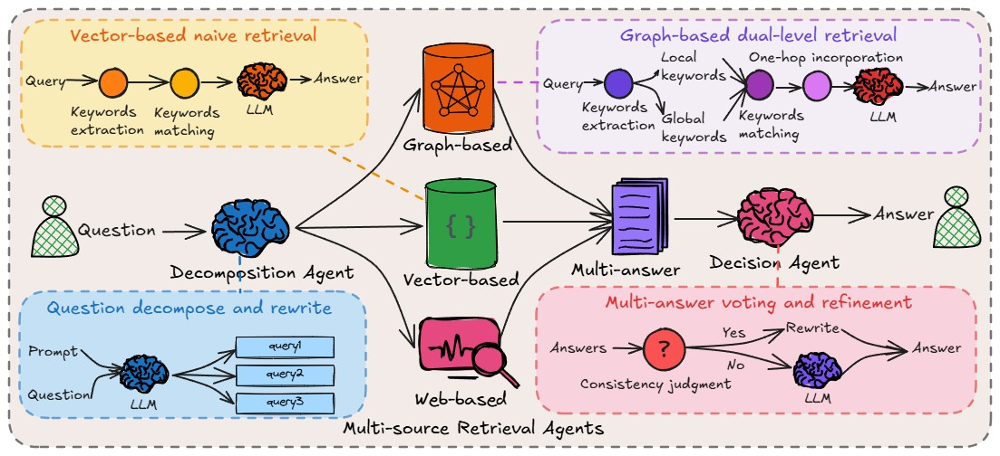
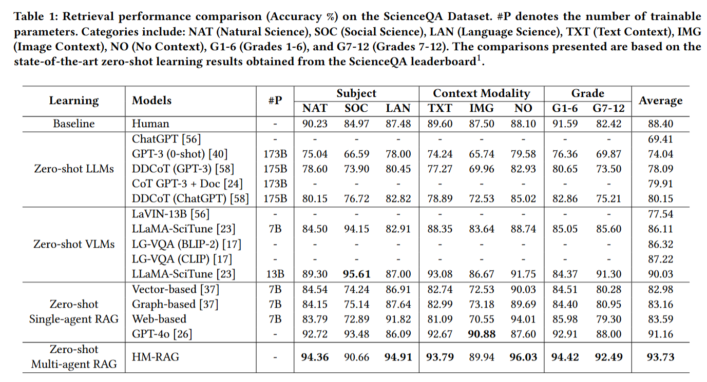

<h1 align="center">HM-RAG: Hierarchical Multi-Agent Multimodal Retrieval Augmented Generation</h1>

<p align="center">
    <a href="https://arxiv.org/abs/2504.12330">
        
    </a>
    <a href="https://github.com/ocean-luna/HMRAG">
        
    </a>
</p>

## News
```2025-04-13``` 🎉🎉 Release our paper: [HM-RAG: Hierarchical Multi-Agent Multimodal Retrieval Augmented Generation](https://arxiv.org/abs/2504.12330).

## Release Plan
- [x] Paper
- [ ] Optimized multi-retrieval methods
- [ ] Optimized generation mechanism

## Introduction
We present HM-RAG, a novel Hierarchical Multi-agent Multimodal RAG framework that pioneers collaborative intelligence for dynamic knowledge synthesis across structured, unstructured, and graph-based data. The framework is composed of three-tiered architecture with specialized agents: a Decomposition Agent that dissects complex queries into contextually coherent sub-tasks via semantic-aware query rewriting and schema-guided context augmentation; Multi-source Retrieval Agents that carry out parallel, modality-specific retrieval using plug-and-play modules designed for vector, graph, and web-based databases; and a Decision Agent that uses consistency voting to integrate multi-source answers and resolve discrepancies in retrieval results through Expert Model Refinement.



## Install

You can create a Conda environment and install dependencies using requirements.txt :
```bash
conda create --name hmrag python=3.10
conda activate hmrag
pip install -r requirements.txt
```
Or setup environment with provided YML :
```bash
conda env create -f environment.yml
```

To facilitate your running, we recommend installing the `Ollama` library to download models. You can also use `Hugging Face` to download the corresponding LLMs.

**Ollama**  [https://ollama.com/](https://ollama.com/)

**Hugging Face**  [https://huggingface.co/](https://huggingface.co/)

## Usage
If you want to test with the dataset we used, you can run to download the data.
```bash
bash datasets/download_ScienceQA.sh
```

### Vector and graph retrieval agent
We utilize LightRAG, a lightweight framework to construct MMKGs. For comprehensive details regarding LightRAG, kindly visit the official repository: [https://github.com/HKUDS/LightRAG](https://github.com/HKUDS/LightRAG).

### Multi-Agent Inference
```bash
python main.py --working_dir  --serper_api_key  --openai_key
```


### Zero-Shot Multimodal Question Answering



## Citation
If you find this repository useful, please consider giving a star ⭐ and citation.
```
@article{liu2025hm,
  title={Hm-rag: Hierarchical multi-agent multimodal retrieval augmented generation},
  author={Liu, Pei and Liu, Xin and Yao, Ruoyu and Liu, Junming and Meng, Siyuan and Wang, Ding and Ma, Jun},
  journal={arXiv preprint arXiv:2504.12330},
  year={2025}
}
```